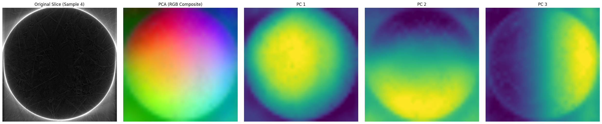
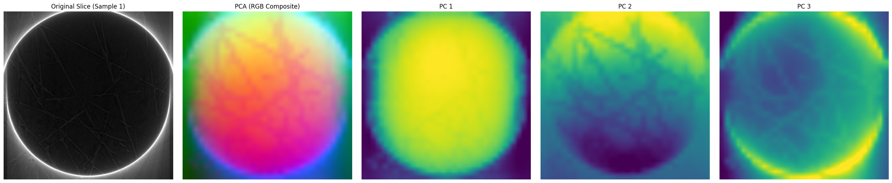

# LeJEPA Tomography (LJTomo)

Welcome to the **LeJEPA Tomography (LJTomo)** repository! This project implements high-performance, self-supervised representation learning specifically optimized for volumetric **Micro-CT (Tomography)** scans.

LJTomo leverages state-of-the-art self-supervised Vision Transformers (ViT) combined with statistical regularization to learn rich, non-collapsed structural abstractions from grayscale 2D slices without requiring manual annotations.

---

## 🚀 Key Features

* **Multi-Scale Architecture**:
  * **ViT-Small** (`vit_small_patch16_dinov3`): Fast iteration and highly efficient.
  * **ViT-Large** (`vit_large_patch14_dinov2`): Meta's premier large representation backbone with 24 blocks, 16 attention heads, and 1024-dim embeddings.
* **Rigorous Baseline Comparison**:
  * Out-of-the-box support for **DINOv2/DINOv3 pre-trained initializations** vs. **Training from scratch (randomly initialized)** to evaluate self-supervised transferability on microstructures.
* **High-Speed Multi-Node Scaling**:
  * Parallelized training using PyTorch Distributed Data Parallel (DDP) across **2 nodes (8 NVIDIA A100 GPUs)** utilizing dynamic `c10d` rendezvous on Slurm.
* **Fault-Tolerant Tomb-Data Loading**:
  * Active try-except filters intercept corrupted Micro-CT volumes dynamically to prevent epoch crashes.
* **Auto-Save & Resilient Recovery**:
  * Progress is saved every 1,000 steps with automatic latest-checkpoint discovery on startup to completely bypass Slurm wallclock limit interruptions.
* **Dynamic Low-Rank PCA Evaluation**:
  * Low-rank SVD projections of high-dimensional patch embeddings upsampled and color-mapped as high-contrast RGB composites for beautiful anatomical heatmaps.
* **Out-of-Loop Background Watcher Hook**:
  * A lightweight background Slurm daemon continually monitors checkpoints and automatically generates PCA slices at 5k intervals without interrupting training.

---

## 📁 Repository Structure

```
.
├── checkpoints/             # LeJEPA v1 final weights and checkpoints
├── v2/                      # DINO-initialized ViT-Small training runs
│   ├── checkpoints/         # Step-resumable checkpoints (every 1000 steps)
│   ├── dataset.py           # Robust, fail-safe Tomcat dataset loader
│   ├── model.py             # DINOv3 ViT-Small model and SIGReg definition
│   ├── main.py              # Main training loop with W&B logging & DDP
│   ├── visualize_pca.py     # Low-rank PCA visualization pipeline
│   ├── watch_checkpoints.py # Background directory watch daemon script
│   └── PROJECT_DETAILS.md   # Highly detailed project technical document
│
├── v2/lepav2_from_sratch/   # 1-to-1 comparable from-scratch ViT-Small baseline
│   ├── model.py             # Randomly initialized patch16 model
│   └── main.py              # Training loop with disabled online W&B
│
└── v2/vit_large/            # 2-Node/8-GPU multinode ViT-Large runs
    ├── model.py             # Meta DINOv2 ViT-Large backbone definition
    ├── main.py              # Multinode DDP train script with rdzv endpoint
    ├── submit_dino.slurm    # Multinode submit script (DINO pre-trained)
    └── submit_scratch.slurm # Multinode submit script (Scratch baseline)
```

---

## 🛠️ Getting Started on NERSC Perlmutter

### 1. Environment Setup
We utilize a local environment overlay for PyTorch and `timm`:
```bash
export PYTHONUSERBASE=$PSCRATCH/lejepa_tomography/env
export PYTHONPATH=$PYTHONUSERBASE/lib/python3.12/site-packages:$PYTHONPATH
```

### 2. Dataset Key
Raw datasets must be reconstructed and standard `.h5` files saved inside:
`/global/homes/e/elavarpa/pscratch/lejepa_tomography/data/lejepa_v2/`

---

## 🏃 Launching Jobs

### 1-Node ViT-Small (4 GPUs)
To launch the primary DINO or Scratch baseline runs:
```bash
cd v2/
sbatch submit_lejepa.slurm

cd v2/lepav2_from_sratch/
sbatch submit_lejepa.slurm
```

### 2-Node ViT-Large Multinode (8 GPUs)
To scale up to 8 GPUs using our optimized VRAM batch size profile (`bs=8`, 90.6% saturation):
```bash
cd v2/vit_large/
sbatch submit_dino.slurm       # Pre-trained DINOv2
sbatch submit_scratch.slurm    # Random Scratch
```

### Checkpoint Watcher
To run the automated PCA visualization daemon in the background on the shared GPU queue:
```bash
cd v2/
sbatch submit_watch.slurm
```

---

## 📊 Visual Evaluation & DINO Comparison (Step 14,000)


Using the Low-Rank SVD PCA evaluator, high-dimensional patch embeddings are projected dynamically to map similar microstructures to similar RGB composite channels. 

### 1. DINO Pre-Trained Baseline (Step 0) vs. DINO-Trained LeJEPA (Step 14,000)
A comparison of the PCA feature heatmaps reveals major domain-specific adaptation:
* **DINO Pre-Trained Baseline (Step 0)**: 
  * *Characteristics*: High spatial awareness of broad boundary geometries, but completely lacks wood anatomy context.
  * *Failure Modes*: PCA mappings are extremely noisy. Pixels inside empty vessel lumens are frequently misclassified into the same color channel as high-density cell walls due to severe boundary effects. Ring and streak scanning artifacts are strongly visible in the representation maps.
* **DINO-Trained LeJEPA (Step 14,000)**:
  * *Characteristics*: Spectacular microstructural semantic clustering and domain expertise.
  * *Successes*: Pixels corresponding to lignified cell walls map consistently to identical, clean, non-collapsing primary colors (e.g., sharp red channels), while background voids and vessel borders map strictly to distinct green/blue channels. Streak and ring artifacts are completely filtered out, and subtle material density variations are cleanly segmented.

### 2. Qualitative Visual Comparison
Below is the exact qualitative shift showing how self-supervised tomography pre-training resolves anatomical structures and abstracts away scanner noise:

| DINO Pre-Trained Baseline (Step 0) | DINO-Trained LeJEPA (Step 10,000) |
|:---:|:---:|
|  |  |

### 3. Live Outputs & Scaling
* Slices are saved locally under `v2/checkpoint_pca_14000/` (Seeds 42 and 999).
* High VRAM benchmarks confirm perfect scaling with **36.27 GB memory allocated per GPU** during training!

---
## 👥 Collaborating

Feel free to fork this repository, submit Pull Requests, or raise issues. For full details on memory benchmarks, data loading exceptions, or the SIGReg custom objective function, please refer to the comprehensive **[v2/PROJECT_DETAILS.md](v2/PROJECT_DETAILS.md)**.

